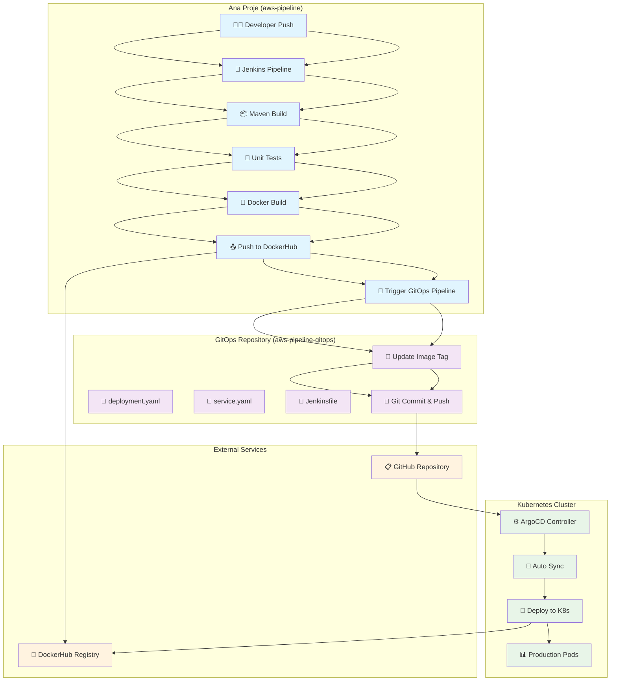
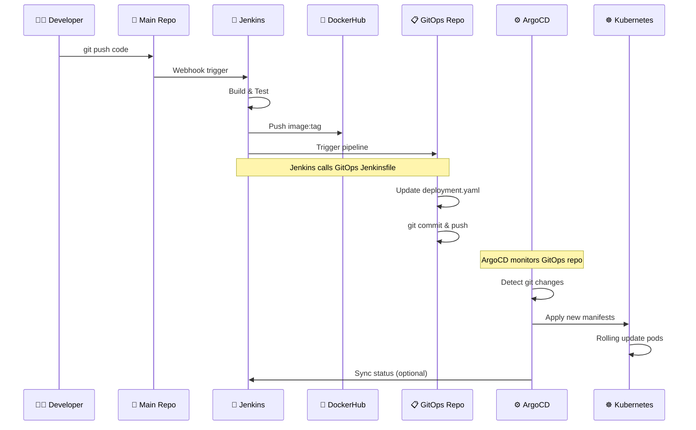
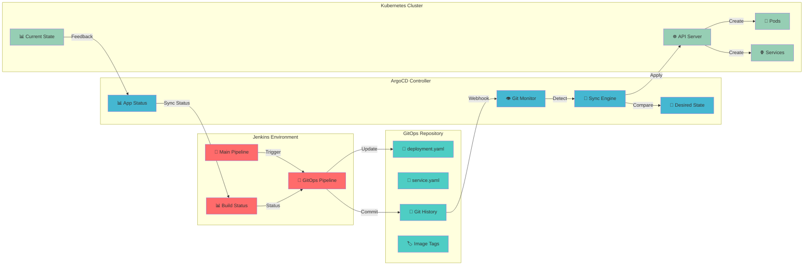

# 🚀 AWS Pipeline GitOps

Bu repository, [aws-pipeline](https://github.com/onurglr/aws-pipeline) ana projesinin GitOps deployment manifest'lerini içerir.

## 📁 İçerik

- **`deployment.yaml`** - Kubernetes Deployment manifest
- **`service.yaml`** - Kubernetes Service manifest  
- **`Jenkinsfile`** - GitOps pipeline (deployment tag güncelleme)

## 🔄 GitOps Workflow

1. Ana projede yeni image build edilir
2. Jenkins pipeline deployment tag'ini günceller
3. ArgoCD otomatik olarak değişiklikleri algılar
4. Kubernetes cluster'a yeni versiyon deploy edilir

## 🛠️ Kullanım

```bash
# Deployment'ı manuel olarak güncelle
kubectl apply -f deployment.yaml
kubectl apply -f service.yaml

# Status kontrol
kubectl get pods -l app=aws-pipeline-cd
kubectl get svc aws-pipeline-cd
```

## 🔗 Bağlantılar

- **Ana Proje**: [aws-pipeline](https://github.com/onurglr/aws-pipeline)
- **Docker Image**: `onurguler18/devopspipeline-aws`
- **Port**: 8080 (NodePort: 31824)

## 🔄 GitOps Workflow Diyagramı

### **Genel Workflow:**



### **ArgoCD ↔ GitOps ↔ Jenkins Detaylı İlişki:**



### **ArgoCD, GitOps ve Jenkins Bağlantı Detayları:**



## 🎯 GitOps Repository'sinin Rolü

### **Ana Proje (aws-pipeline):**
- **Code Development**: Spring Boot uygulaması
- **CI Pipeline**: Build, test, Docker image
- **Artifact Creation**: Docker image oluşturma

### **GitOps Repository (aws-pipeline-gitops):**
- **Deployment Configs**: Kubernetes manifest'leri
- **Image Tag Management**: Otomatik tag güncelleme
- **GitOps Trigger**: Ana projeden tetiklenen pipeline

### **Kubernetes Cluster:**
- **ArgoCD**: Git değişikliklerini izler
- **Auto Deployment**: Otomatik sync ve deploy
- **Production**: Canlı ortam

### **Workflow Akışı:**

1. **👨‍💻 Developer** → Code push
2. **🔧 Jenkins** → Build, test, Docker
3. **🐳 DockerHub** → Image push
4. **🚀 GitOps Pipeline** → Tag güncelleme
5. **📝 Git** → Manifest commit
6. **⚙️ ArgoCD** → Otomatik algılama
7. **🚀 Kubernetes** → Production deploy

---
*Bu repository GitOps pattern'i kullanarak otomatik deployment sağlar.*
